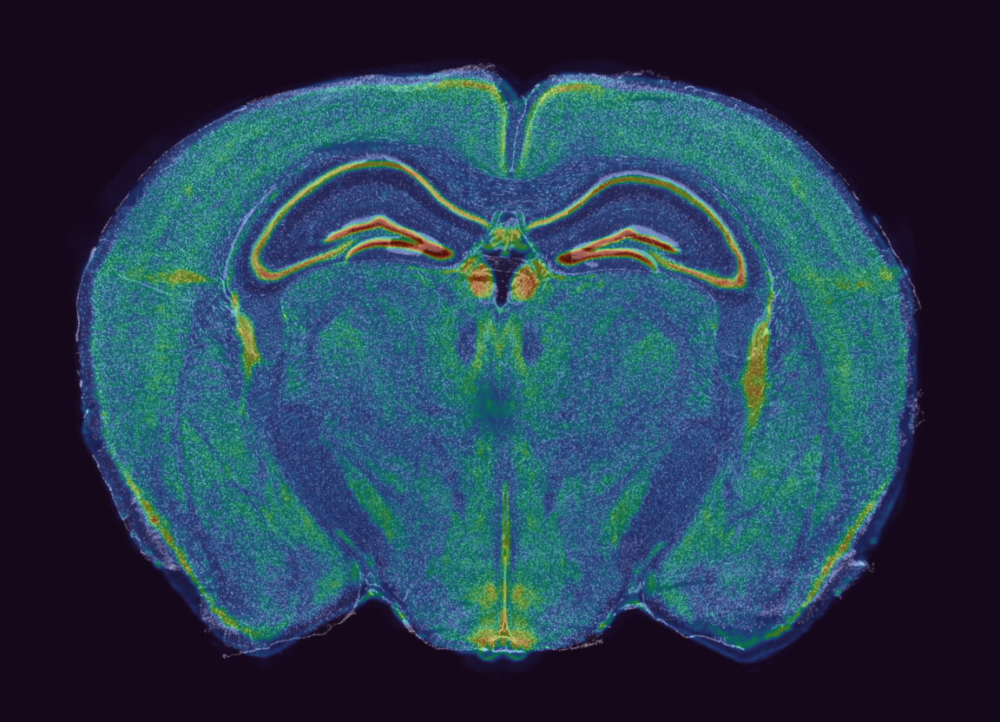
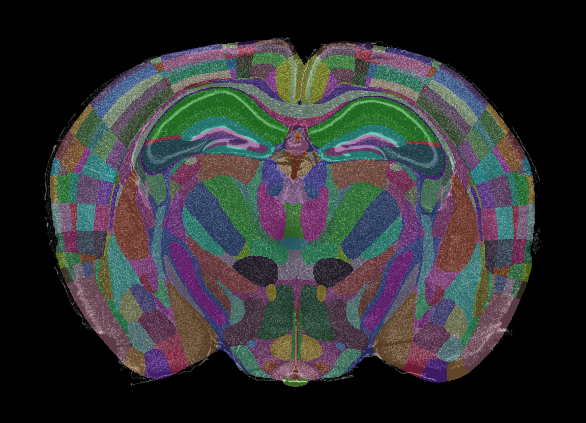

## Brain-Registration

Four-step brain slice registration pipeline (Step1~Step4):

1. Preprocessing (grayscale, resampling, tissue mask)
2. Slice search + affine registration (to Allen Nissl)
3. Nonlinear refinement (B-spline)
4. Apply transforms to annotation (Allen annotation)

Script directory: `script/`

Detailed technical documentation: [docs/TECHNICAL_DOCUMENTATION.md](docs/TECHNICAL_DOCUMENTATION.md)

- `run_registration_pipeline.py`: main entry (recommended)
- `step1_preprocess.py`
- `step2_affine.py`
- `step3_nonlinear.py`
- `step4_apply_label.py`

---

## 1. Environment

Recommended: Python 3.9+ with the following dependencies:

- `numpy`
- `scikit-image`
- `SimpleITK`
- `matplotlib`

Example install command (adapt to your environment manager):

```bash
pip install numpy scikit-image SimpleITK matplotlib
```

---

## 2. Quick Start (Recommended)

Run from the project root:

```bash
python ./script/run_registration_pipeline.py \
	--data-path /path/to/your/whole_brain.tif \
    --atlas-nissl /path/to/Allen_nissl_atlas \
    --atlas-annotation  /path/to/Allen_annotation_atlas \
    --input-res resolution (whole_brain.tif) \
    --target-res resolution (Allen)
```

Optional arguments (main entry):

- `--atlas-nissl`: Allen nissl atlas path
- `--atlas-annotation`: Allen annotation atlas path
- `--input-res`: input resolution
- `--target-res`: target resolution (default: `10.0` um/px)
- `--atlas-slice`: manually specify atlas slice (auto-search if omitted)
- `--slice-search-radius`, `--slice-search-step`, `--search-resize-max`: Step2 search range/speed-accuracy controls
- `--search-workers`: Step2 parallel workers (recommended `2~8`)
- `--sitk-threads`: SimpleITK thread count (use `1` for better reproducibility)
- `--neighbor-smooth-sigma`: Step2 slice-score smoothing parameter

---

## 3. Output Directory Structure

For input image `xxx.tif`, outputs are generated next to it as `xxx_registration_result/`:

```text
xxx_registration_result/
├── 01.preprocess/
├── 02.affine/
├── 03.nonlinear/
└── 04.apply_label/
```

Key outputs:

- `02.affine/*_affine.tif`: Step2 affine result
- `02.affine/*_step2_record.json`: Step2 parameters and metrics
- `03.nonlinear/*_nonlinear.tif`: Step3 nonlinear result
- `03.nonlinear/*_step3_record.json`: Step3 parameters and metrics
- `04.apply_label/*_label.tif`: final warped annotation result


<p align="center">
    <a href="docs/image/03.nonlinear/test.png">
        
    </a>
    <a href="docs/image/04.apply_label/test.png">
        
    </a>
</p>

<p align="center">
    <sub>Left: Nissl registration | Right: Annotation registration (click images for full size)</sub>
</p>